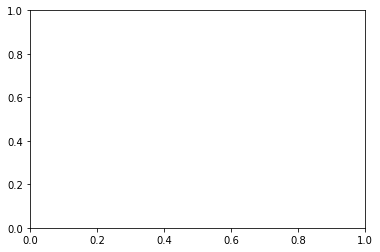
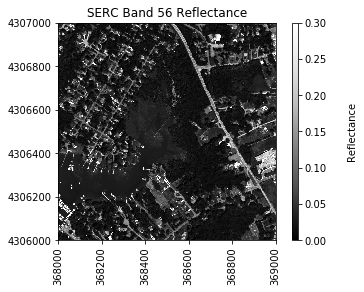
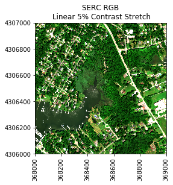

# Band Stacking, RGB & False Color Images Using Functions

## Objectives 
In the first lesson, we learned how to read in hdf5 data using h5py, apply the no-data value and scale factor, and plot a single band of a reflectance data tile. We can do these tasks more efficiently using functions. In this lesson, we will introduce functions `aop_h5refl2array` to . We will also plot different combinations of bands, and demonstrate how to create `IPython widgets` for more interactive data visualization. 


## Background on RGB & False-Color Images

We can combine any three bands from the NEON reflectance data to make an **RGB** image that allows us to visualize spectral data collected at the Earth's surface. A **natural-color** image, made with bands from the red, green, and blue wavelengths looks close to what we would see with the naked eye, or what we would see in a typical photograph. We can also choose band combinations from other wavelengths, and map them to the red, blue, and green colors to highlight different spectral features. A **false-color** image is made with one or more bands from a non-visible portion of the electromagnetic spectrum that are mapped to red, green, and blue colors. These images can display other information about the landscape that is not easily seen with a natural-color image. 

The NASA Goddard Media Studio video *Peeling Back Landsat's Layers of Data* gives a good overview of natural and false color band combinations. Note that Landsat collects information from 11 wavelength bands, while NEON AOP hyperspectral data collects information from 426 bands!

<a href="https://www.youtube.com/watch?v=YP0et8l_bvY" target="_blank"></a>

https://www.youtube.com/watch?v=YP0et8l_bvY
https://svs.gsfc.nasa.gov//vis/a010000/a011400/a011491/index.html

**Further Reading**: Check out the NASA Earth Observatory Article on "How to Interpret a False-Color Satellite Image"

https://earthobservatory.nasa.gov/Features/FalseColor/

Before we get started, let's import our standard packages, and set up our plot and warning preferences:


```python
import matplotlib.pyplot as plt
import numpy as np
import h5py, os, osr, copy
%matplotlib inline
import warnings
warnings.filterwarnings('ignore')
```

The first function we will use is `aop_h5refl2array`. This function is loaded into the cell below, we encourage you to look through the code to understand what it is doing -- most of these steps should look familiar to you from the first lesson. This function can be thought of as a wrapper to automate the steps required to read AOP hdf5 reflectance tiles into a Python format. This function also cleans the data: it sets any no data values within the reflectance tile to `nan` (not a number) and applies the reflectance scale factor so the final array that is returned represents unitless scaled reflectance, with values ranging between 0 and 1 (0-100%). 


```python
def aop_h5refl2array(refl_filename):
    """aop_h5refl2array reads in a NEON AOP reflectance hdf5 file and returns 
           1. reflectance array (with the no data value and reflectance scale factor applied)
           2. dictionary of metadata including spatial information, and wavelengths of the bands
    --------
    Parameters
        refl_filename -- full or relative path and name of reflectance hdf5 file
    --------
    Returns 
    --------
    reflArray:
        array of reflectance values
    metadata:
        dictionary containing the following metadata:
            bad_band_window1 (tuple)
            bad_band_window2 (tuple)
            bands: # of bands (float)
            data ignore value: value corresponding to no data (float)
            epsg: coordinate system code (float)
            map info: coordinate system, datum & ellipsoid, pixel dimensions, and origin coordinates (string)
            reflectance scale factor: factor by which reflectance is scaled (float)
            wavelength: wavelength values (float)
            wavelength unit: 'm' (string)
    --------
    NOTE: This function applies to the NEON hdf5 format implemented in 2016, and should be used for
    data acquired 2016 and after. Data in earlier NEON hdf5 format (collected prior to 2016) is 
    expected to be re-processed after the 2018 flight season. 
    --------
    Example Execution:
    --------
    sercRefl, sercRefl_metadata = h5refl2array('NEON_D02_SERC_DP3_368000_4306000_reflectance.h5') """
    
    import h5py
    
    #Read in reflectance hdf5 file 
    hdf5_file = h5py.File(refl_filename,'r')

    #Get the site name
    file_attrs_string = str(list(hdf5_file.items()))
    file_attrs_string_split = file_attrs_string.split("'")
    sitename = file_attrs_string_split[1]
    
    #Extract the reflectance & wavelength datasets
    refl = hdf5_file[sitename]['Reflectance']
    reflData = refl['Reflectance_Data']
    reflRaw = refl['Reflectance_Data'].value
    
    #Create dictionary containing relevant metadata information
    metadata = {}
    metadata['map info'] = refl['Metadata']['Coordinate_System']['Map_Info'].value
    metadata['wavelength'] = refl['Metadata']['Spectral_Data']['Wavelength'].value

    #Extract no data value & scale factor
    metadata['data ignore value'] = float(reflData.attrs['Data_Ignore_Value'])
    metadata['reflectance scale factor'] = float(reflData.attrs['Scale_Factor'])
    #metadata['interleave'] = reflData.attrs['Interleave']
    
    #Apply no data value
    reflClean = reflRaw.astype(float)
    arr_size = reflClean.shape
    if metadata['data ignore value'] in reflRaw:
        print('% No Data: ',np.round(np.count_nonzero(reflClean==metadata['data ignore value'])*100/(arr_size[0]*arr_size[1]*arr_size[2]),1))
        nodata_ind = np.where(reflClean==metadata['data ignore value'])
        reflClean[nodata_ind]=np.nan 
    
    #Apply scale factor
    reflArray = reflClean/metadata['reflectance scale factor']
    
    #Extract spatial extent from attributes
    metadata['spatial extent'] = reflData.attrs['Spatial_Extent_meters']
    
    #Extract bad band windows
    metadata['bad band window1'] = (refl.attrs['Band_Window_1_Nanometers'])
    metadata['bad band window2'] = (refl.attrs['Band_Window_2_Nanometers'])
    
    #Extract projection information
    #metadata['projection'] = refl['Metadata']['Coordinate_System']['Proj4'].value
    metadata['epsg'] = int(refl['Metadata']['Coordinate_System']['EPSG Code'].value)
    
    #Extract map information: spatial extent & resolution (pixel size)
    mapInfo = refl['Metadata']['Coordinate_System']['Map_Info'].value
    
    hdf5_file.close        
    
    return reflArray, metadata
```

If you forget what this function does, or don't want to scroll up to read the docstrings, remember you can use `help` or `?` to display the associated docstrings. 


```python
help(aop_h5refl2array)
aop_h5refl2array?
```

    Help on function aop_h5refl2array in module __main__:
    
    aop_h5refl2array(refl_filename)
        aop_h5refl2array reads in a NEON AOP reflectance hdf5 file and returns 
               1. reflectance array (with the no data value and reflectance scale factor applied)
               2. dictionary of metadata including spatial information, and wavelengths of the bands
        --------
        Parameters
            refl_filename -- full or relative path and name of reflectance hdf5 file
        --------
        Returns 
        --------
        reflArray:
            array of reflectance values
        metadata:
            dictionary containing the following metadata:
                bad_band_window1 (tuple)
                bad_band_window2 (tuple)
                bands: # of bands (float)
                data ignore value: value corresponding to no data (float)
                epsg: coordinate system code (float)
                map info: coordinate system, datum & ellipsoid, pixel dimensions, and origin coordinates (string)
                reflectance scale factor: factor by which reflectance is scaled (float)
                wavelength: wavelength values (float)
                wavelength unit: 'm' (string)
        --------
        NOTE: This function applies to the NEON hdf5 format implemented in 2016, and should be used for
        data acquired 2016 and after. Data in earlier NEON hdf5 format (collected prior to 2016) is 
        expected to be re-processed after the 2018 flight season. 
        --------
        Example Execution:
        --------
        sercRefl, sercRefl_metadata = h5refl2array('NEON_D02_SERC_DP3_368000_4306000_reflectance.h5')
    
    

Now that we have an idea of how this function works, let's try it out. First, define the path where th e reflectance data is stored and use `os.path.join` to create the full path to the data file. Note that if you want to run this notebook later on a different reflectance tile, you just have to change this variable. 


```python
serc_h5_tile = ('../data/NEON_D02_SERC_DP3_368000_4306000_reflectance.h5') 
```

Now that we've specified our reflectance tile, we can call `aop_h5refl2array` to read in the reflectance tile as a python array called `sercRefl` , and the associated metadata into a dictionary `sercMetadata`


```python
sercRefl,sercMetadata = aop_h5refl2array(serc_h5_tile)
```

We can use the `shape` method to see the dimensions of the array we read in. NEON tiles are (1000 x 1000 x # of bands), the number of bands may vary depending on the hyperspectral sensor used, but should be in the vicinity of 426.  


```python
sercRefl.shape
```


    (1000, 1000, 426)


## Use `plot_aop_refl` to plot a single band of reflectance data 

Next we'll use the function `plot_aop_refl` to plot a single band of reflectance data. Read the `Parameters` section of the docstring to understand the required inputs & data type for each of these; only the band and spatial extent are required inputs, the rest are optional inputs that, if specified, allow you to set the range color values, specify the axis, add a title, colorbar, colorbar title, and change the colormap (default is to plot in greyscale). 


```python
def plot_aop_refl(band_array,refl_extent,colorlimit=(0,1),ax=plt.gca(),title='',cbar ='on',cmap_title='',colormap='Greys'):
    
    '''plot_refl_data reads in and plots a single band or 3 stacked bands of a reflectance array
    --------
    Parameters
    --------
        band_array: array of reflectance values, created from aop_h5refl2array
        refl_extent: extent of reflectance data to be plotted (xMin, xMax, yMin, yMax) 
                     use metadata['spatial extent'] from aop_h5refl2array function
        colorlimit: optional, range of values to plot (min,max). 
                    - helpful to look at the histogram of reflectance values before plotting to determine colorlimit.
        ax: optional, default = current axis
        title: optional; plot title (string)
        cmap_title: optional; colorbar title 
        colormap: optional (string, see https://matplotlib.org/examples/color/colormaps_reference.html) for list of colormaps
    --------
    Returns 
    --------
        plots flightline array of single band of reflectance data
    --------

    Examples:
    --------
    plot_aop_refl(sercb56,
              sercMetadata['spatial extent'],
              colorlimit=(0,0.3),
              title='SERC Band 56 Reflectance',
              cmap_title='Reflectance',
              colormap='Greys_r') '''
    
    import matplotlib.pyplot as plt
    
    plot = plt.imshow(band_array,extent=refl_extent,clim=colorlimit); 
    if cbar == 'on':
        cbar = plt.colorbar(plot,aspect=40); plt.set_cmap(colormap); 
        cbar.set_label(cmap_title,rotation=90,labelpad=20)
    plt.title(title); ax = plt.gca(); 
    ax.ticklabel_format(useOffset=False, style='plain'); #do not use scientific notation for ticklabels
    rotatexlabels = plt.setp(ax.get_xticklabels(),rotation=90); #rotate x tick labels 90 degrees
```





Now that we have loaded this function, let's extract a single band from the SERC reflectance array and plot it:


```python
sercb56 = sercRefl[:,:,55]
```


```python
plot_aop_refl(sercb56,
              sercMetadata['spatial extent'],
              colorlimit=(0,0.3),
              title='SERC Band 56 Reflectance',
              cmap_title='Reflectance',
              colormap='Greys_r') 
```





## RGB Plots - Band Stacking
It is often useful to look at several bands together. We can extract and stack three reflectance bands in the red, green, and blue (RGB) spectrums to produce a color image that looks like what we see with our eyes; this is your typical camera image. In the next part of this tutorial, we will learn to stack multiple bands and make a geotif raster from the compilation of these bands. We can see that different combinations of bands allow for different visualizations of the remotely-sensed objects and also conveys useful information about the chemical makeup of the Earth's surface. 

For this exercise, we'll first use the neon_aop_module function `stack_rgb` to extract the bands we want to stack. This function uses splicing to extract the nth band from the reflectance array, and then uses the numpy function `stack` to create a new 3D array (1000 x 1000 x 3) consisting of only the three bands we want. 


```python
def stack_rgb(reflArray,bands):
    
    import numpy as np
    
    red = reflArray[:,:,bands[0]-1]
    green = reflArray[:,:,bands[1]-1]
    blue = reflArray[:,:,bands[2]-1]
    
    stackedRGB = np.stack((red,green,blue),axis=2)
    
    return stackedRGB
```

First we will look at red, green, and blue bands, whos indices are defined below. To confirm that these band indices correspond to wavelengths in the expected portion of the spectrum, we can print out the wavelength values stored in `metadata['wavelength']`:


```python
rgb_bands = (58,34,19)

print('Band 58 Center Wavelength = %.2f' %(sercMetadata['wavelength'][57]),'nm')
print('Band 33 Center Wavelength = %.2f' %(sercMetadata['wavelength'][33]),'nm')
print('Band 19 Center Wavelength = %.2f' %(sercMetadata['wavelength'][18]),'nm')
```

    Band 58 Center Wavelength = 668.98 nm
    Band 33 Center Wavelength = 548.80 nm
    Band 19 Center Wavelength = 473.68 nm
    

We selected these bands so that they fall within the visible range of the electromagnetic spectrum (400-700 nm):


Below we use `stack_rgb` to create an RGB array. Check that the dimensions of this array are as expected.
- **TIP**: checking the shape of arrays with `.shape` is a good habit to get into when creating your own workflows, and can be a handy tool for troubleshooting. 


```python
SERCrgb = stack_rgb(sercRefl,rgb_bands)
SERCrgb.shape
```


    (1000, 1000, 3)


## Use `plot_aop_refl` to plot an RGB band combination

Next, we can use the function `plot_aop_refl`, even though we have more than one band. This function only works for a single or 3-band array, so ensure the array you use has the proper dimensions before using. You do not need to specify the colorlimits as the `matplotlib.pyplot` automatically scales 3-band arrays to 8-bit color (256). 


```python
plot_aop_refl(SERCrgb,
               sercMetadata['spatial extent'],
               title='SERC RGB Image',
               cbar='off') 
```


You'll notice that this image is very dark; it is possible to make out some of the features (roads, buildings), but it is not ideal. Since colorlimits don't apply to 3-band images, we have to use some other image processing tools to enhance the visibility of this image. 

## Image Processing -- Contrast Stretch & Histogram Equalization 

We can also try out some image processing routines to better visualize the reflectance data using the ```ski-image``` package. 

Histogram equalization is a method in image processing of contrast adjustment using the image's histogram. Stretching the histogram can improve the contrast of a displayed image by eliminating very high or low reflectance values that skew the display of the image. 

<p>

</p>

Let's see what the image looks like using a 5% linear contrast stretch using the `skiimage` module's `exposure` function.


```python
from skimage import exposure
```


```python
def plot_aop_rgb(rgbArray,ext,ls_pct=5,plot_title=''):
    
    from skimage import exposure
    
    pLow, pHigh = np.percentile(rgbArray[~np.isnan(rgbArray)], (ls_pct,100-ls_pct))
    img_rescale = exposure.rescale_intensity(rgbArray, in_range=(pLow,pHigh))
    plt.imshow(img_rescale,extent=ext)
    plt.title(plot_title + '\n Linear ' + str(ls_pct) + '% Contrast Stretch'); 
    ax = plt.gca(); ax.ticklabel_format(useOffset=False, style='plain') #do not use scientific notation #
    rotatexlabels = plt.setp(ax.get_xticklabels(),rotation=90) #rotate x tick labels 90 degree
```


```python
plot_aop_rgb(SERCrgb,
             sercMetadata['spatial extent'],
             plot_title = 'SERC RGB')
```





## False Color Image - Color Infrared (CIR)
We can also create an image from bands outside of the visible spectrum. An image containing one or more bands outside of the visible range is called a **false-color image**. Here we'll use the green and blue bands as before, but we replace the red band with a near-infrared (NIR) band. 

For more information about non-visible wavelengths, false color images, and some frequently used false-color band combinations, refer to NASA's Earth Observatory page:

https://earthobservatory.nasa.gov/Features/FalseColor/


```python
CIRbands = (90,34,19)
print('Band 90 Center Wavelength = %.2f' %(sercMetadata['wavelength'][89]),'nm')
print('Band 34 Center Wavelength = %.2f' %(sercMetadata['wavelength'][33]),'nm')
print('Band 19 Center Wavelength = %.2f' %(sercMetadata['wavelength'][18]),'nm')

SERCcir = stack_rgb(sercRefl,CIRbands)
plot_aop_rgb(SERCcir,
             sercMetadata['spatial extent'],
             ls_pct=2,
             plot_title='SERC CIR')
```

    Band 90 Center Wavelength = 829.24 nm
    Band 34 Center Wavelength = 548.80 nm
    Band 19 Center Wavelength = 473.68 nm
    


## Demo: Exploring Band Combinations Interactively

Now that we have made a couple different band combinations, we can demo a Python `widget` to explore different combinations of bands in the visible and non-visible portions of the spectrum. 


```python
from IPython.html.widgets import *
```


```python
array = copy.copy(sercRefl)
metadata = copy.copy(sercMetadata)

def RGBplot_widget(R,G,B):
    
    #Pre-allocate array  size
    rgbArray = np.zeros((array.shape[0],array.shape[1],3), 'uint8')
    
    Rband = array[:,:,R-1].astype(np.float)
    #Rband_clean = clean_band(Rband,Refl_md)
    
    Gband = array[:,:,G-1].astype(np.float)
    #Gband_clean = clean_band(Gband,Refl_md)
    
    Bband = array[:,:,B-1].astype(np.float)
    #Bband_clean = clean_band(Bband,Refl_md)
    
    rgbArray[..., 0] = Rband*256
    rgbArray[..., 1] = Gband*256
    rgbArray[..., 2] = Bband*256
    
    # Apply Adaptive Histogram Equalization to Improve Contrast:
    
    img_nonan = np.ma.masked_invalid(rgbArray) #first mask the image 
    img_adapteq = exposure.equalize_adapthist(img_nonan, clip_limit=0.10)
    
    plot = plt.imshow(img_adapteq,extent=metadata['spatial extent']); 
    plt.title('Bands: \nR:' + str(R) + ' (' + str(round(metadata['wavelength'][R-1])) +'nm)'
              + '\n G:' + str(G) + ' (' + str(round(metadata['wavelength'][G-1])) + 'nm)'
              + '\n B:' + str(B) + ' (' + str(round(metadata['wavelength'][B-1])) + 'nm)'); 
    ax = plt.gca(); ax.ticklabel_format(useOffset=False, style='plain') 
    rotatexlabels = plt.setp(ax.get_xticklabels(),rotation=90) 
    
interact(RGBplot_widget, R=(1,426,1), G=(1,426,1), B=(1,426,1))
```


<p>Failed to display Jupyter Widget of type <code>interactive</code>.</p>
<p>
  If you're reading this message in the Jupyter Notebook or JupyterLab Notebook, it may mean
  that the widgets JavaScript is still loading. If this message persists, it
  likely means that the widgets JavaScript library is either not installed or
  not enabled. See the <a href="https://ipywidgets.readthedocs.io/en/stable/user_install.html">Jupyter
  Widgets Documentation</a> for setup instructions.
</p>
<p>
  If you're reading this message in another frontend (for example, a static
  rendering on GitHub or <a href="https://nbviewer.jupyter.org/">NBViewer</a>),
  it may mean that your frontend doesn't currently support widgets.
</p>


    <function __main__.RGBplot_widget>


## Demo: Interactive Linear Stretch & Equalization

Here is another widget to play around with, demonstrating how to interactively visualize linear contrast stretches with a variable percent. 


```python
rgbArray = copy.copy(SERCrgb)

def linearStretch(percent):
    pLow, pHigh = np.percentile(rgbArray[~np.isnan(rgbArray)], (percent,100-percent))
    img_rescale = exposure.rescale_intensity(rgbArray, in_range=(pLow,pHigh))
    plt.imshow(img_rescale,extent=sercMetadata['spatial extent'])
    plt.title('SERC RGB \n Linear ' + str(percent) + '% Contrast Stretch'); 
    ax = plt.gca()
    ax.ticklabel_format(useOffset=False, style='plain') 
    rotatexlabels = plt.setp(ax.get_xticklabels(),rotation=90) 

interact(linearStretch,percent=(0,20,1))
```


<p>Failed to display Jupyter Widget of type <code>interactive</code>.</p>
<p>
  If you're reading this message in the Jupyter Notebook or JupyterLab Notebook, it may mean
  that the widgets JavaScript is still loading. If this message persists, it
  likely means that the widgets JavaScript library is either not installed or
  not enabled. See the <a href="https://ipywidgets.readthedocs.io/en/stable/user_install.html">Jupyter
  Widgets Documentation</a> for setup instructions.
</p>
<p>
  If you're reading this message in another frontend (for example, a static
  rendering on GitHub or <a href="https://nbviewer.jupyter.org/">NBViewer</a>),
  it may mean that your frontend doesn't currently support widgets.
</p>


    <function __main__.linearStretch>


### References & Resources

Kekesi, Alex et al. "NASA | Peeling Back Landsat's Layers of Data". https://svs.gsfc.nasa.gov/vis/a010000/a011400/a011491/. Published on Feb 24, 2014.

Riebeek, Holli. "Why is that Forest Red and that Cloud Blue? How to Interpret a False-Color Satellite Image" https://earthobservatory.nasa.gov/Features/FalseColor/ 

Histogram Equalization: 
http://opencv-python-tutroals.readthedocs.io/en/latest/py_tutorials/py_imgproc/py_histograms/py_histogram_equalization/py_histogram_equalization.html

`skikit-image` tutorial:
http://scikit-image.org/docs/stable/auto_examples/color_exposure/plot_equalize.html#sphx-glr-auto-examples-color-exposure-plot-equalize-py

